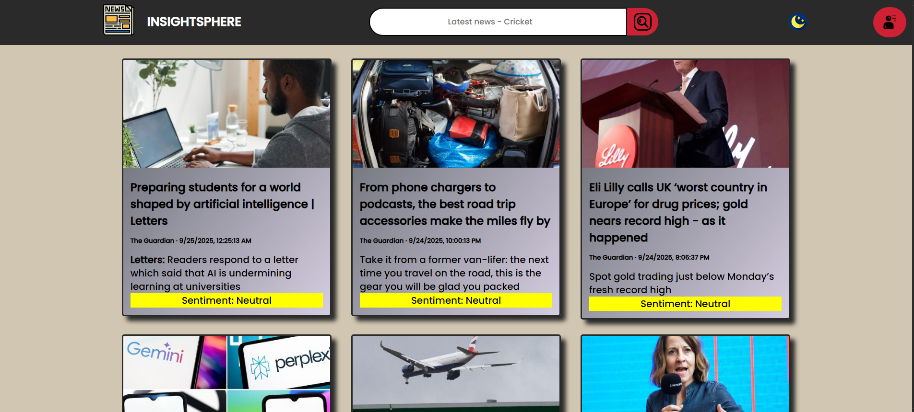
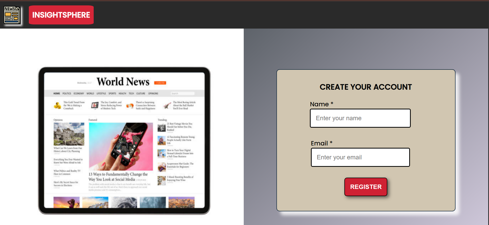
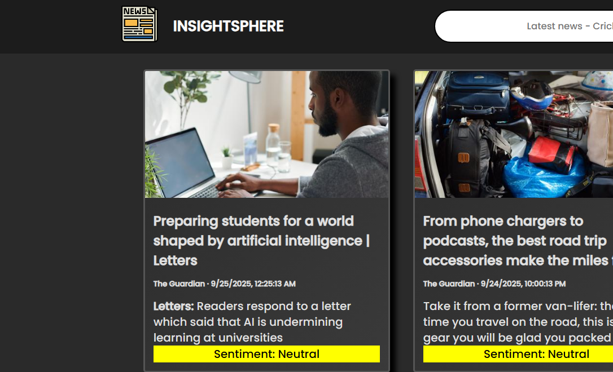

# InsightSphere - News Aggregation App

A modern, responsive news application that delivers curated news articles from trusted sources worldwide. Built with vanilla JavaScript and deployed on Vercel for optimal performance.

## ✨ Features

### 📰 **Real-Time News Feed**
- Live news articles from The Guardian API
- Fresh content updated throughout the day
- Multiple news categories and topics

### 🎯 **Personalized Experience** 
- User registration with preference selection
- Customized news feed based on your interests
- Save your favorite news categories

### 🔍 **Smart Search & Filtering**
- Real-time search functionality
- Filter by categories: Technology, Business, Sports, Health, Science, Entertainment, Politics, and more
- Advanced filtering options

### 🌙 **Modern Interface**
- Dark/Light theme toggle
- Fully responsive design for all devices
- Clean, intuitive user interface
- Professional card-based layout

### ⚡ **Performance Optimized**
- Client-side caching for faster load times
- Efficient API usage with request optimization
- Pagination for better content management

## 📸 Screenshots

### Main News Feed (Light Mode)

*Browse the latest news articles with our clean, modern interface*

### Registration & Preferences 

*Simple registration process with personalized news category selection*

### Main News Feed (Dark Mode)

*Comfortable dark theme for reading news in low-light conditions*

### Registration Form

*Clean registration form with real-time validation*

## 🚀 Getting Started

### Live Demo
Visit [InsightSphere](https://your-vercel-url.vercel.app) to try the app

### Local Development

1. **Clone the repository**
   ```bash
   git clone <your-repository-url>
   cd newsapp
   ```

2. **Open locally**
   - Simply open `index.html` in your web browser
   - No build process required - pure vanilla JavaScript

3. **Start exploring**
   - Register with your name and email
   - Select your news preferences  
   - Enjoy personalized news content

## 📱 How to Use

### Step 1: Registration
- Enter your name and email address
- Form validation ensures correct information

### Step 2: Select Preferences
- Choose from 8 news categories
- Select multiple categories for diverse content
- Your preferences are saved for future sessions

### Step 3: Explore News
- Browse curated articles on the main page
- Use search to find specific topics
- Filter by categories using the sidebar
- Toggle between light and dark themes

## 🛠️ Technology Stack

- **Frontend**: HTML5, CSS3, Vanilla JavaScript
- **API**: The Guardian Open Platform API
- **Deployment**: Vercel (Static Site Hosting)
- **Styling**: Custom CSS with responsive design
- **Performance**: Client-side caching, optimized API calls

## 🎨 Design Features

- **Responsive Layout**: Works seamlessly on desktop, tablet, and mobile
- **Modern UI**: Clean card-based design with smooth animations  
- **Theme Support**: Switch between light and dark modes
- **Professional Icons**: Category-specific icons for better UX
- **Form Validation**: Real-time validation with helpful error messages

## 🔧 Project Structure

```
newsapp/
├── index.html          # Registration page (entry point)
├── mainpage.html       # Main news display page
├── script.js           # Core application logic
├── home.js            # Registration and validation logic
├── config.js          # API configuration
├── style.css          # Main page styles
├── home.css           # Registration page styles
├── vercel.json        # Deployment configuration
└── assets/
    ├── icons/         # Category and UI icons
    └── images/        # App images and graphics
```

## 🌟 Key Highlights

- **Real News Data**: Powered by The Guardian's trusted journalism
- **Free & Open**: No subscription required, free tier provides ample usage
- **Fast Loading**: Optimized performance with smart caching
- **User-Friendly**: Intuitive interface suitable for all age groups
- **Mobile First**: Responsive design that works on any device

## 🤝 Contributing

Contributions are welcome! Feel free to:
- Report bugs or issues
- Suggest new features
- Submit pull requests
- Improve documentation

## 📄 License

This project is open source and available under the [MIT License](LICENSE).

---

Built with ❤️ using modern web technologies. Experience the future of news consumption with InsightSphere!
